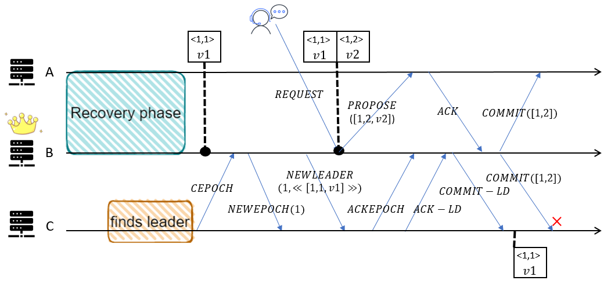
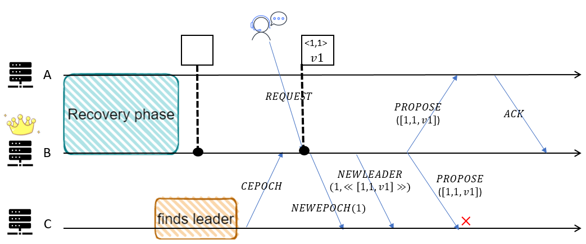

# Zab的TLA+规约 文档

## 概述
-	本实验是由论文*Junqueira F P, Reed B C, Serafini M. Zab: High-performance broadcast for primary-backup systems[C]//2011 IEEE/IFIP 41st International Conference on Dependable Systems & Networks (DSN). IEEE, 2011: 245-256.*启发。本实验根据该论文描述的Zab协议进行了Zab的TLA+规约。
-	我们对Zab使用TLA+工具做了形式化规约，并在此基础上做了一定量的模型检验来验证Zab的正确性。
-	当前我们同样完成了对最新版的ZooKeeper开源项目中的[ZAB 1.0](https://github.com/BinyuHuang-nju/zookeeper/tree/master/zookeeper-specifications)的形式化规约。  
-	由于论文中对Zab算法描述的精简和细节上的省略，在进行规约时协议中的一些细节由本实验作者进行修改和增加。如有疑问，欢迎指出。

## 支撑平台
TLA+ toolbox 版本1.7.0

## 运行
>具体配置环境手段见主目录README相应模块。  

创建规约并以正常方式建模并运行模型。  
我们通过该规约，能够很清晰地将规约划分为五个模块：  
- Phase0. 选主阶段  
- Phase1. 发现阶段  
- Phase2. 同步阶段    
- Phase3. 广播阶段    
- 各种异常情况如节点失效、网络断连等 

## 规约中的抽象
>论文中的Zab协议不关注选主过程，我们对选主过程进行抽象；且规约中能够模拟系统中的非拜占庭错误；此外，我们关注的是系统内状态的一致，从而抽象或省略了如向客户端回复结果等一些实际实现中的处理。

### 对选主过程的抽象
由于论文不关注选主，但是为了使模型可被运行，选主模块是不可或缺的。我们用动作*UpdateLeader*和*FollowLeader*来完成选主。

### 对通信介质的抽象
Zab使用的通信信道是TCP信道，所以消息传递不会出现丢包、冗余、乱序的情况，我们用*Sequence*模块来模拟满足按序接收消息的信道，故这里的信道和端到端的TCP信道存在一定差异。我们认为某个服务器不执行接收消息的动作可以模拟消息延迟，某个服务器不执行任何动作可以模拟单机失败。

### 对与系统状态无关的动作的抽象和省略
我们关心的是系统内状态的一致，不关心客户端(client)向系统请求执行和系统向客户端回复结果等的细节，以及各个服务器向副本(复制状态机)提交事务(deliver transaction)的细节。因此我们粗化了*ClientRequest*，省略了向客户端的回复。我们假设每一个可提交的事务会被立即提交到副本中，故可用变量*history[i][1..commitIndex]*来模拟节点*i*向副本提交的事务序列。

## 与论文的差异
>该部分描述的是规约与论文的协议之间的差异。我们将我们自己的做法融入进规约中。

### Issue 1 Line: 377, Action: UpdateLeader, FollowLeader
由于论文不关注选主模块，我们使用全局变量*leaderOracle*来简化选主模块。在动作*UpdateLeader*中，我们让*LOOKING*状态的服务器变成新的领导者，并更新*leaderOracle*。在动作*FollowLeader*中，我们让处于*LOOKING*状态的服务器根据*leaderOracle*切换状态到*FOLLOWING*或*LEADING*。

### Issue 2 Line: 495, Action: LeaderProcessCEPOCH, LeaderProcessACKEPOCH, LeaderProcessACKLD
在论文的伪代码中，总是提到领导者向*Q*广播某个消息，如*NEWEPOCH*、*NEWLEADER*、*PROPOSE*等等。但是*Q*在每个阶段所代表哪些服务器，这是非常模糊的，在论文中也没有进一步说明。我们将*learners*定义为与某个领导者建立连接的服务器集合，*cepochRecv*为领导者接收到*CEPOCH*的服务器集合，*ackeRecv*为领导者接收到*ACKEPOCH*的服务器集合，*ackldRecv*为领导者接收到*ACKLD*的服务器集合，则我们知道*ackldRecv* ⊆  *ackeRecv* ⊆ *cepochRecv* ⊆ *learners*。又很显然让领导者向*epochRecv*中的服务器广播*COMMITLD*是很显然错误的，因为*cepochRecv*中可能存在跟随者还没接收到*NEWLEADER*。所以在论文中定义每一个*Q*代表的集合是非常有必要的。  
这里我们让*cepochRecv*在*step l.1.1*中作为*Q*来广播*NEWECPOCH*，*ackeRecv* 在*step l.2.1*中作为*Q*来广播*NEWLEADER*，*ackldRecv*作为*Q*在*step l.2.2* 中广播*COMMITLD*。  

### Issue 3 Line: 889, Action: LeaderBroadcastPROPOSE, LeaderProcessACK
事实上，除了*NEWEPOCH*、*NEWLEADER*和*COMMITLD*，领导者还需要在*BROADCAST*阶段广播*PROPOSE*和*COMMIT*。根据论文伪代码中的*step l.3.3*和*step l.3.4*，我们最初认为领导者广播这两个类型的消息的集合都是*ackldRecv*，这是很自然的。但这会带来一个bug，其中跟随者接收到了本地日志中不存在的事务的*COMMIT*。  
   
这是因为根据论文中的*step l.3.4*，跟随者直到接收到了*COMMITLD*，才会接收到*PROPOSE*。  
于是我们在规约中的做法是，当领导者广播*PROPOSE*时，*Q*是*ackeRecv*，当领导者广播*COMMIT*时，*Q*是*ackldRecv*。因此，任何收到*PROPOSE*的跟随者肯定在这之前接收过*COMMITLD*。  
所以，我们也不应该在*step l.3.3*中，当领导者接收到*CEPOCH*时直接回复*NEWEPOCH*和*NEWLEADER*，而是和之前的阶段一样，回复*NEWEPOCH*，然后等待接收到*ACKEPOCH*后再回复*NEWLEADER*，这样才能陆续更新*ackeRecv*和*ackldRecv*。  
此外，这里的*COMMITLD*所提交的事务可能不仅仅包含*NEWLEADER*中的事务，还会包含一些*PROPOSE*中的事务的提交。这也是因为*PROPOSE*和*COMMIT*的广播集合不同，一些还在恢复阶段的跟随者可能不会接收到对应的*COMMIT*，而是在*COMMITLD*中一并被提交了。  
所以这里我们成功找到了论文伪代码中的一个bug。

### Issue 4 Line: 921, Action: FollowerProcessPROPOSE
在规约中，我们假设领导者处理来自客户端的请求和领导者广播*PROPOSE*这两个动作不是原子执行的，这样会存在另一个bug，即跟随者可能会收到两个对同一个事务的提议。  
  
从该图中我们可以看到，对zxid为<1,1>的事务，跟随者收到了两次提议。  
我们在规约中的做法是，当跟随者接收到*PROPOSE*时，会进行判断，如果该消息中的zxid是当前日志中的lastZxid的下一个zxid，则接收这个提议，否则说明跟随者本地早已存在这个事务，直接忽略该提议即可。  
在这里我们可以发现，跟随者接收到*PROPOSE*时，要么是该事务已存在于本地，要么是该事务的txn是本地中的下一项zxid。 