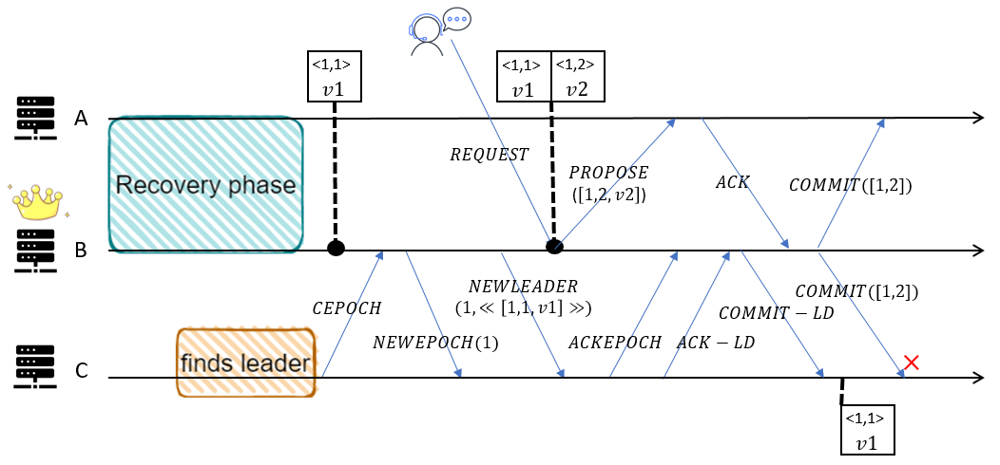
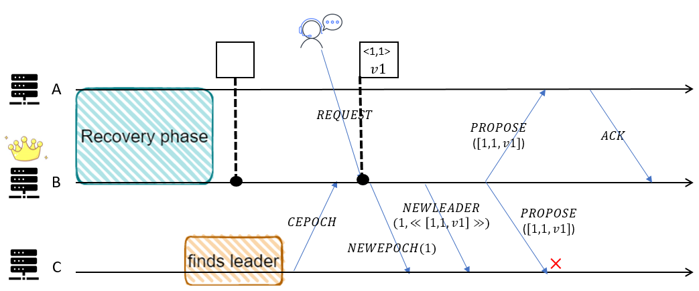

# Issues

>This document describes issues related to the ambiguous description of the Zab protocol. 

### (Issue 1) Line: 377, Action: UpdateLeader, FollowLeader
Since paper pay no attention to leader election, we use global variable *leaderOracle* to simplify election module. In action *UpdateLeader*, we let a server in *LOOKING* be the new leader, and update *leaderOracle*. In action *FollowLeader*, we let a server in *LOOKING* switches its state to *FOLLOWING* or *LEADING* according to *leaderOracle*. 

### (Issue 2) Line: 495, Action: LeaderProcessCEPOCH, LeaderProcessACKEPOCH, LeaderProcessACKLD
In the pseudocode of the paper, it always mentions broadcasting a certain message to *Q* like *NEWEPOCH*, *NEWLEADER*, or *PROPOSE*. But it is very vague that *Q* represents which servers at each stage, and this is not stated in paper. Defining *learners* as the set of servers that establish connection with a certain leader, *cepochRecv* as the set of servers this leader has received *CEPOCH* from, *ackeRecv* as the set of servers this leader has received *ACKEPOCH* from, *ackldRecv* as the set of servers this leader has received *ACKLD* from, we konw that *ackldRecv* ⊆  *ackeRecv* ⊆ *cepochRecv* ⊆ *learners*. It is obviously wrong when we let leader broadcast *COMMITLD* to servers in *cepochRecv*, because there may exist some follower not receiving *NEWLEADER* in *cepochRecv*. So it is very important to define each '*Q*' in paper clearly.  
Here we let *cepochRecv* as *Q* in *step l.1.1* to broadcast *NEWECPOCH*, *ackeRecv* as *Q* in *step l.2.1* to broadcast *NEWLEADER*, *ackldRecv* as *Q* in *step l.2.2* to broadcast *COMMITLD*.

### (Issue 3) Line: 889, Action: LeaderBroadcastPROPOSE, LeaderProcessACK
Except for *NEWEPOCH*, *NEWLEADER* and *COMMITLD*, leader has to broadcst *PROPOSE* and *COMMIT* in *BROADCAST* stage. According to *step l.3.3* and *step l.3.4* in the pseudocode of the paper, we initially assumed leader broadcasts *PROPOSE* or *COMMIT* to servers in *ackldRecv*. Then it would produce a bug in which follower receives commit of a txn which not exists in history.    
    
It is because follower will not receive *PROPOSE* until reiceiving *COMMITLD*, according to *step l.3.4* in paper.  
What we do in spec is when leader broadcasts *PROPOSE*, *Q* is *ackeRecv*, and when leader broadcasts *COMMIT*, *Q* is *ackldRecv*. So any follower that receives *PROPOSE* must have received *NEWLEADER* before, and any follower that receives *COMMIT* must have received *COMMITLD* before.   
So we should not directly reply *NEWEPOCH* and *NEWLEADER* when leader receives *CEPOCH* in *BROADCAST*， described in *step l.3.3*. As the same in the previous stages, leader will not reply *NEWLEADER* until receiving *ACKEPOCH*.  
So here, *COMMITLD* is a commit of txns in *NEWLEADER* and perhaps several *PROPOSE*. Because follower may reply *ACKLD* late, and it may reiceive several messages of *PROPOSE* but no *COMMIT* of corresponding *PROPOSE*. And we successfully find a bug of pseudocode of the paper.

### (Issue 4) Line: 921, Action: FollowerProcessPROPOSE
If action when leader processes *REQUEST* and action when leader broadcasts *PROPOSE* is not atomically performed, there exists another bug in which follower reiceives proposals of one same txn.  
  
We can see that follower C reveives txn with zxid <1,1> twice, which makes conflict.  
What we do is spec is when follower receives *PROPOSE*, if the zxid is the next zxid of lastZxid in history, follower accepts this txn. Else, follower ignores this txn, because this txn must exist in history.  
Here we can find that when follower receives *PROPOSE*, either the txn exist in history, or the zxid of txn is the next zxid in history.   
