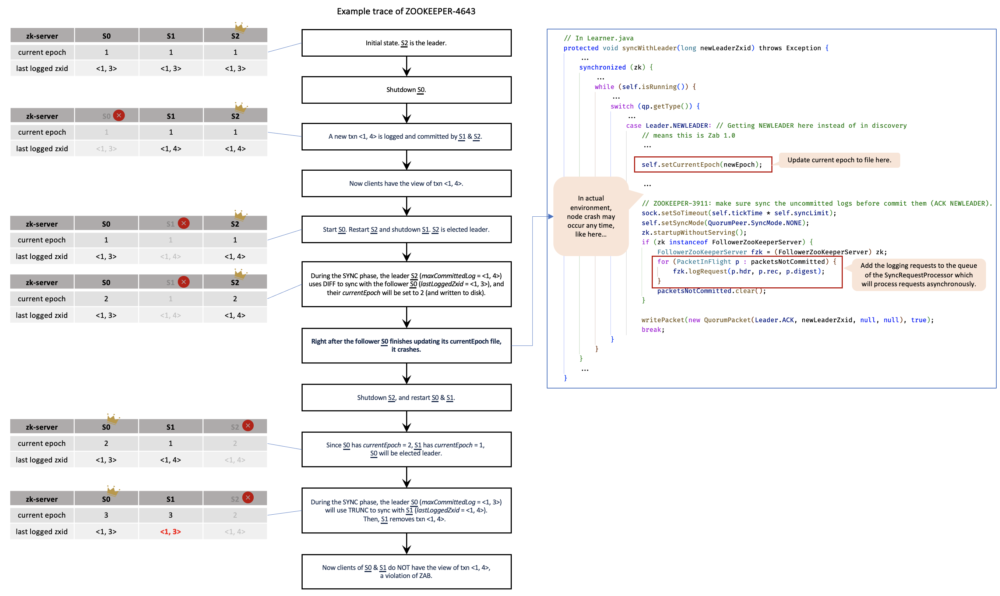
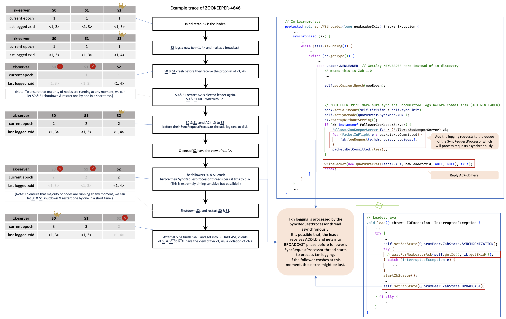

# Triggering of Deep Bugs

Following the [Model Checking-driven Explorative Testing (MET)](https://github.com/Lingzhi-Ouyang/MET) framework, we have reproduced several old deep bugs and uncovered several new deep bugs in ZooKeeper. These subtle bugs will lead to critical property violations like data inconsistency or data loss. However, they are hard to be found, because the timing of the environment failures is quite subtle, and it requires more than ten steps to trigger them. 

Following is the overview of some triggered bugs. Detailed description and analysis of the bugs can be found on [ZooKeeper's issue tracking system](https://issues.apache.org/jira/projects/ZOOKEEPER/issues). Newly discovered deep bugs include 

- [ZK-4643](https://issues.apache.org/jira/browse/ZOOKEEPER-4643): Committed txns may be improperly truncated if follower crashes right after updating currentEpoch but before persisting txns to disk.
  - It will cause committed logs to be lost.
  - It is a violation of the atomicity of two actions that is guaranteed at the protocol level.
  - This bug violates *leaderLogCompleteness* and can be triggered with the spec [zk_test_v3.tla](zk_test_v3/zk_test_v3.tla).

- [ZK-4646](https://issues.apache.org/jira/browse/ZOOKEEPER-4646): Committed txns may still be lost if followers crash after replying ACK-LD but before writing txns to disk.
  - It will cause committed logs to be lost.
  - It is related to the asynchronous execution by multi-thread implementation. It shows that the asynchronous logging of transactions may violate the atomicity of actions.
  - This bug violates *leaderLogCompleteness* and can be triggered with the spec [zk_test_v4.tla](zk_test_v4/zk_test_v4.tla).

* [ZK-4685](https://issues.apache.org/jira/browse/ZOOKEEPER-4685): Unnecessary system unavailability due to Leader shutdown when follower sent ACK of PROPOSAL before sending ACK of NEWLEADER in log recovery.
  * It will lead to unnecessary recovery procedures, consumes extra time before servers get into the BROADCAST phase and reduces the service's availability. 

We also reproduce several well-known deep bugs like

* [ZK-3911](https://issues.apache.org/jira/browse/ZOOKEEPER-3911):  Data inconsistency caused by DIFF sync uncommitted log.

  - It will cause committed logs to be lost.

  - This bug violates *monotonicRead* and can be triggered with the spec [zk_test_v1.tla](zk_test_v1/zk_test_v1.tla).

- [ZK-2845](https://issues.apache.org/jira/browse/ZOOKEEPER-2845): Data inconsistency issue due to retain database in leader election.
  - It will cause transaction logs to be inconsistent.
  - This bug violates *processConsistency* and can be triggered with the spec [zk_test_v1.tla](zk_test_v1/zk_test_v1.tla).
- ...
